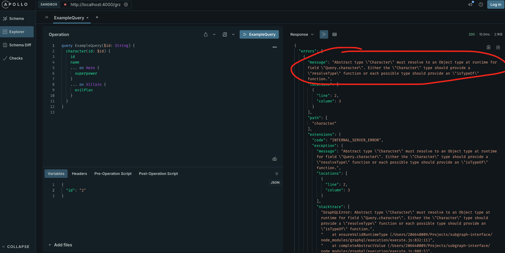

# Apollo GraphQL Subgraph Interface

This is a test project to demonstrate that interfaces' resolveType handler in
graphql-js schemas are ignored.

This project is an Express application that exposes an Apollo GraphQL
subgraph using `graphql-js` to define the schema.

The schema includes a `Character` interface and two types (`Hero` and `Villain`)
that implement this interface.

The `Query` type allows querying characters by their ID.

## Prerequisites

- Node.js
- npm

## Installation

1. Clone the repository:
   ```sh
   git clone <repository-url>
   cd <repository-directory>
   ```

2. Install the dependencies:
   ```sh
   nvm use
   npm install
   ```

## Running the Application

1. Start the server:
   ```sh
   node index.js
   ```

2. The server will be running at:
   ```
   http://localhost:4000/graphql
   ```

## Schema

The GraphQL schema includes the following types:

- **Character** (interface)
    - `id`: String
    - `name`: String

- **Hero** (implements Character)
    - `id`: String
    - `name`: String
    - `superpower`: String

- **Villain** (implements Character)
    - `id`: String
    - `name`: String
    - `evilPlan`: String

## Query

You can query a character by their ID:

```graphql
query {
  character(id: "1") {
    id
    name
    ... on Hero {
      superpower
    }
    ... on Villain {
      evilPlan
    }
  }
}
```

However, the query fails with the following error:



```
"Abstract type \"Character\" must resolve to an Object type at runtime for field \"Query.character\". Either the \"Character\" type should provide a \"resolveType\" function or each possible type should provide an \"isTypeOf\" function."
```

## License

This project is licensed under the MIT License. See the `LICENSE` file for details.